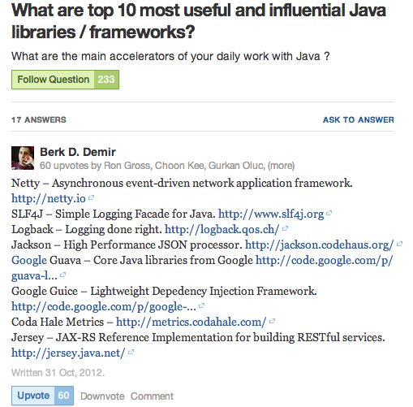
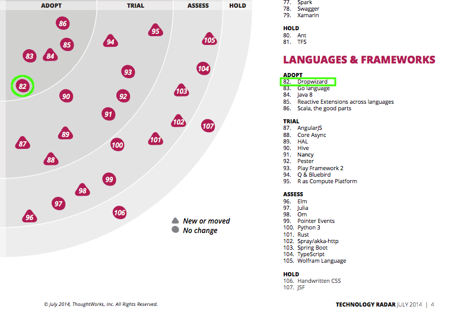
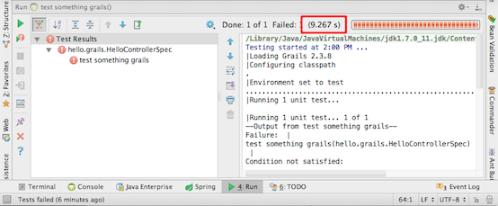
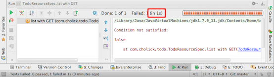

class: center, middle

# Dropwizard
### + Groovy & Gradle

---
# The Plan

1. What is Dropwizard?
1. Why choose it?
1. Code!
  1. Basics
  1. Testing
  1. DI & Data
  1. Create, Updated, Delete
  1. Validation
  1. Misc
  1. Views
1. Additional Gradle

---
# Dropwizard .float-right[]

### A JVM framework for developing ops-friendly, high-performance, RESTful web services

```bash
java -jar app.jar server config.yaml
```

???

* Not based on heavy container - simple to deploy & monitor

---
# Mature Libraries

.float-right[]

* Jersey
* Jackson
* SLF4J
* Jetty
* Guava
* Coda Hale Metrics

---
# ThoughtWorks Radar



---
# TDD Speed

.center[



]

.footnote[
Yes, I know about Grails's daemon
]

???

* Deamon clashed w/ IntelliJ
* CLI runtime reloading too buggy

---
# Code!

### [github.com/cholick/dropwizard-gradle-angular](https://github.com/cholick/dropwizard-gradle-angular/)

.float-right[]

* master is final app
* Branches show progression
  * step01, step02, etc

---
#The Basics

* Gradle setup
* Application
* Resource

```bash
git checkout step01
```

###Demo

```bash
./gradlew run

curl -s localhost:9000/todo | python -m json.tool
```

---
# Testing

[dropwizard-testing](https://dropwizard.github.io/dropwizard/manual/testing.html)

* Serialization and Deserialization
* Resource testing
* Functional testing <sup>1</sup>

```bash
git checkout step01
git merge step02 --no-commit --no-ff
```

###Demo

```bash
./gradlew test
open build/reports/tests/index.html
```

.footnote[
1. Not covering
]

---
#DI & Data

* [ Guice ]( https://github.com/google/guice )
* For demo no db, but framework supports
  * JDBI
  * Hibernate
  * Migrations (Liquibase)
* [ Managed interface ]( http://dropwizard.readthedocs.org/en/latest/manual/core.html#managed-objects )

```bash
git checkout step02
git merge step03 --no-commit --no-ff
```

###Demo

```bash
./gradlew run

curl -s localhost:9000/todo/matt@veryrealemail.com | python -m json.tool
curl -s localhost:9000/todo/asdf@asdf.com | python -m json.tool
```

---
#Remaining Endpoints

* PUT, DELETE, & POST
* Framework [recently added](https://dropwizard.github.io/dropwizard/about/release-notes.html#v0-7-1) PATCH


```bash
git checkout step03
git merge step04 --no-commit --no-ff
```

###Demo

```bash
./gradlew run

curl -s localhost:9000/todo/asdf@asdf.com | python -m json.tool
curl -sX POST -d '{"item": "Buy milk"}' localhost:9000/todo/asdf@asdf.com \
     --header 'Content-Type:application/json'
curl -s localhost:9000/todo/asdf@asdf.com | python -m json.tool
```

---
#Validation

### javax.validation
* @NotEmpty, @NotNull
* @Email
* @Max, @Min
* @Past, @Future

```bash
git checkout step04
git merge step05 --no-commit --no-ff
```

###Demo

```bash
./gradlew run

curl -svX POST -d '{}' localhost:9000/todo/asdf@asdf.com \
     --header 'Content-Type:application/json'
```

---
#Misc

### Healthcheck
### Asset bundle

```bash
git checkout step05
git merge step06 --no-commit --no-ff
```
###Demo

```bash
./gradlew run

curl -s localhost:9001/healthcheck | python -m json.tool
open http://localhost:9000/
```

---
#Views

* [ Freemarker ]( http://freemarker.org/ )
* [ Mustache ]( https://github.com/spullara/mustache.java )


```bash
git checkout step06
git merge step07 --no-commit --no-ff
```

###Demo

```bash
./gradlew run

curl -s http://localhost:9000/api/todo/matt@veryrealemail.com/ | python -m json.tool
open http://localhost:9000/api/todo/matt@veryrealemail.com/view
```

---
#Additional Gradle

Runtime class reloading
Using [ Spring-Loaded ]( https://github.com/spring-projects/spring-loaded ) javaagent
* Same library powers Grails reloading
* A Recent [ blog post ]( http://www.cholick.com/entry/show/280 ) explaining in detail

```bash
git checkout step07
git merge step08 --no-commit --no-ff
```

###Demo

```bash
./gradlew dev

curl -s http://localhost:9000/api/todo/matt@veryrealemail.com/ | python -m json.tool
```

---
class: center, middle

# Matt Cholick
.contact[
  ### [@cholick](https://twitter.com/cholick)
  ### [http://www.cholick.com](http://www.cholick.com)
]
